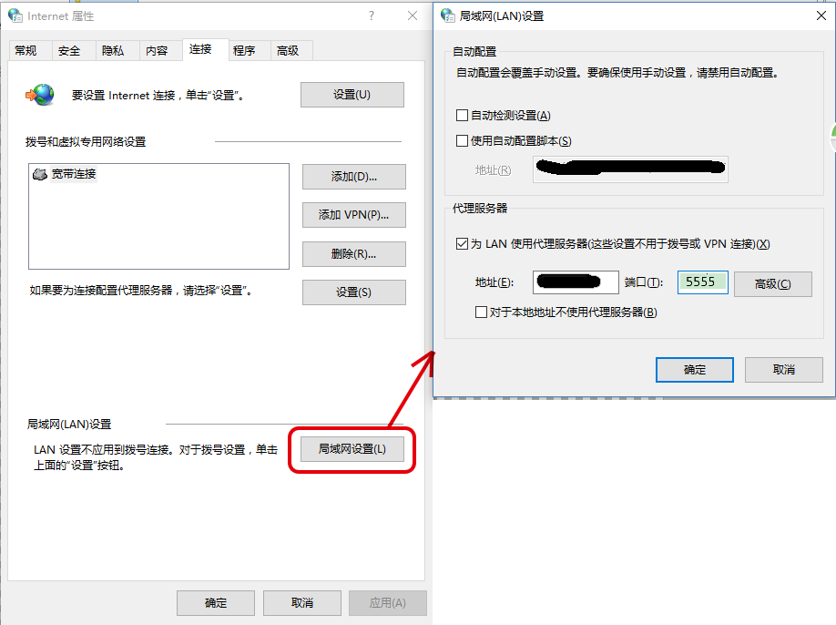

# node-web-proxy
A HTTP(S) Forward Proxy Cluster built upon nodejs
<!-- # Motivation
不知作为过客的你，是否正在被困扰于与我相同的付费VPN问题？

> 购买了一款3G流量的**单连接**VPN服务。但是，一方面，贪婪地期望：自己的手机、平板电脑、Linux开发机、甚至老爸的台机都能*同时*享受VPN服务；另一方面，又对 **多连接**VPN服务的 翻番价格 与 流量浪费 心有不干。

甚至，即使作为一家新兴科技公司的老板，为了让自己的软件开发者能够使用Google更快地搜索到最匹配的技术资源，你又是否舍得按人头给每一位开发者分别购买VPN连接呢？如果一款《个人版 单连接 VPN付费服务》能够在公司内由多位员工共享使用，那企不是完美了？

此外，因为我们既不在YouTube上看视频，也不向Google Drive上传或下载大文件，相反，每天仅只刷刷技术文章的网页（还得减去 读技术文章与查字典的时间），一家创业公司，一个月下来，才能使用几个G的流量呀！

所以，这个开源项目应运而生，瞬间将一款**单连接**VPN付费服务 变成 一款 **多连接**VPN服务。 -->
# Requirements
1. nodejs v8.x+
1. If it's expected to register the HTTP(S) Forward Proxy Cluster as a system service, Windows 7+ is imperative.
1. If it's acceptable to start up the HTTP(S) Forward Proxy Cluster in CLI, the Linux is good as well.
1. A VPN client (e.g. [Shadowsocks](https://github.com/shadowsocks/shadowsocks-windows)) has been installed in your machine.
1. You must be aware of the port number of the VPN client. As for [Shadowsocks](https://github.com/shadowsocks/shadowsocks-windows), it's *1080* by default.

# Characteristics
1. In contrast with the Apache/Nginx Proxy module, the HTTP(S) Forward Proxy Cluster is capable of propagating the HTTPS requests.
1. The whitelist of the Client IP addresses. Only the enrolled guests are able to enjoy the paid part of the HTTP(S) Forward Proxy Cluster. Conversely, the remaining requests originating from the other tourists are directly delivered to their target web sites and deliberately bypass the VPN pipe.
    * Reference configuration file: ./config/guest-whitelist.json
1. [GFWlist](https://adblockplus.org/en/filter-cheatsheet) filter rules. Only the HTTP(S) requests against the inaccessible web sites actually pass through the VPN pipe, for the sake of the network-flow economy.
    * Reference configuration file: ./config/pac-rules.json

# Components
The HTTP(S) Forward Proxy is composed of THREE core JS files.
1. service-register.js
    * Function: Register the HTTP(S) Forward Proxy Cluster as a Windows System Service and start it as well. Since then, the HTTP(S) Forward Proxy Cluster will be always automatically launched, once the Windows OS is started.
1. forward-proxy-cluster.js
    * Function: Start up a HTTP(S) Forward Proxy Cluster in Linux-Shell/Windows-CMD CLI.
1. forward-proxy.js
    * Function: Start up a HTTP(S) Forward Proxy in Linux-Shell/Windows-CMD CLI.

# Usage
Because the project hasn't been still uploaded to NPM, the procedure of its installation is a little tedious.

1. Download the ZIP file.
1. Decompress it into any folder.
1. Go to the project-root directory.
1. Open the CLI/Shell terminal.
1. Run:
    1. npm install
    1. npm link
    1. web-proxy --service-install

Done. After that,
1. The HTTP(S) Forward Proxy Cluster is accessible through the URL: http://<*your ip address*>:5555
1. The VPN client listening on the port 1080 is depended on by the HTTP(S) Forward Proxy Cluster. That's to say, the HTTP(S) Forward Proxy Cluster relays some of requests to the VPN client.
1. Last but not least, your web browser must be configured to put the HTTP(S) Forward Proxy Cluster to use by delivering the HTTP Connect command to it. See the snapshot:
<!--
     -->
# Detail Usage
```
usage: service-register.js [-h] [-v] [-si] [-su] [-st] [-sp] [-sr] [-t]
                           [-p] [-spp] [-gwl] [-pr]


A HTTP(S) Forward Proxy built upon nodejs

Optional arguments:
  -h, --help
      Show this help message and exit.
  -v, --version
      Show program's version number and exit.
  -si, --service-install
      Install HTTP(S) Proxy as a system service
  -su, --service-uninstall
      Uninstall HTTP(S) Proxy as a system service
  -st, --service-start
      Start the system-service HTTP(S) Proxy
  -sp, --service-stop
      Stop the system-service HTTP(S) Proxy
  -sr, --service-restart
      Restart the system-service HTTP(S) Proxy
  -t, --trace
      Trace the proxy logs
  -p, --port
      The port on which the HTTP(S) Proxy to listens.
      (Default: 5555)
  -spp, --system-proxy-port
      The port number of the system proxy underlying
      the HTTP(S) Forward Proxy. (Default: 1080)
  -gwl, --guest-whitelist
      Only the clients enjoy the paid forward proxy
      whose ips are in the whitelist file.
  -pr, --pac-rules
      Only the web sites the paid forward proxy
      whose ips are in the whitelist file.
```

```
usage: forward-proxy-cluster.js [-h] [-v] [-p] [-spp]
                                [-gwl] [-pr]


A HTTP(S) Forward Proxy built upon nodejs

Optional arguments:
  -h, --help
      Show this help message and exit.
  -v, --version
      Show program's version number and exit.
  -p PORT, --port PORT
      The port on which the HTTP(S) Proxy to listens.
      (Default: 5555)
  -spp, --system-proxy-port
      The port number of the system proxy underlying the
      HTTP(S) Forward Proxy. (Default: 1080)
  -gwl, --guest-whitelist
      Only the clients enjoy the paid forward proxy whose
      ips are in the whitelist file.
  -pr, --pac-rules
      Only the web sites the paid forward proxy whose ips
      are in the whitelist file.
```

```
usage: forward-proxy.js [-h] [-v] [-p] [-spp]
                        [-gwl] [-pr]


A HTTP(S) Forward Proxy built upon nodejs

Optional arguments:
  -h, --help
      Show this help message and exit.
  -v, --version
      Show program's version number and exit.
  -p PORT, --port PORT
      The port on which the HTTP(S) Proxy to listens.
      (Default: 5555)
  -spp, --system-proxy-port
      The port number of the system proxy underlying the
      HTTP(S) Forward Proxy. (Default: 1080)
  -gwl, --guest-whitelist
      Only the clients enjoy the paid forward proxy whose
      ips are in the whitelist file.
  -pr, --pac-rules
      Only the web sites the paid forward proxy whose ips
      are in the whitelist file.
```